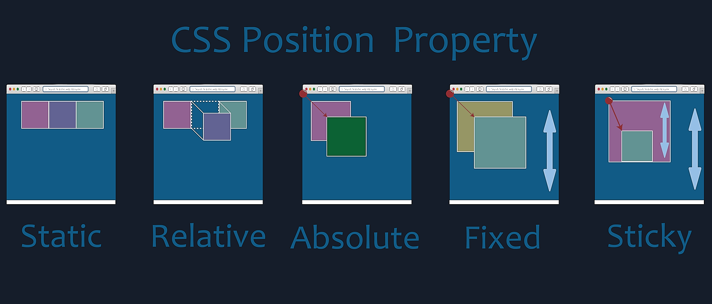

## General Info

{width:700px}

## Static

- The element is positioned according to the normal flow of the document.
- The top, right, bottom, left, and z-index properties have no effect.

## Relative

- The element is positioned according to the normal flow of the document, and then offset relative to itself based on the values of top, right, bottom, and left.
- The offset does not affect the position of any other elements; thus, the space given for the element in the page layout is the same as if position were static.
- Child absolute elements how remain within the bounds of a relative element.

## Absolute

- Removes from document order flow
- Allows use of top, right, etc
- Absolute elements will remain within the bounds of any relative and absolute parent element or the root of the document.

## Fixed

- Removes from document order flow
- Fixed element to the viewport
- Allows use of top, right, etc
- Fixed position when you scroll

## Sticky

- Combination between relative and absolute
- It is part of the normal document flow until it is scrolled past
- Once scrolled it becomes fixed to based on its position
