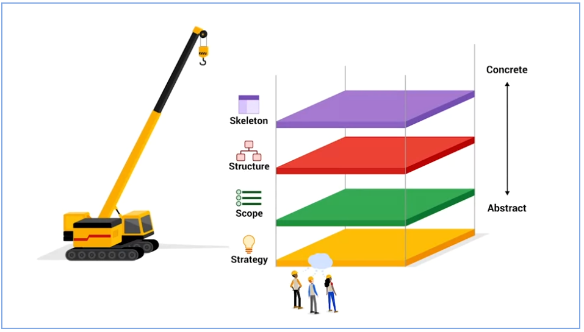
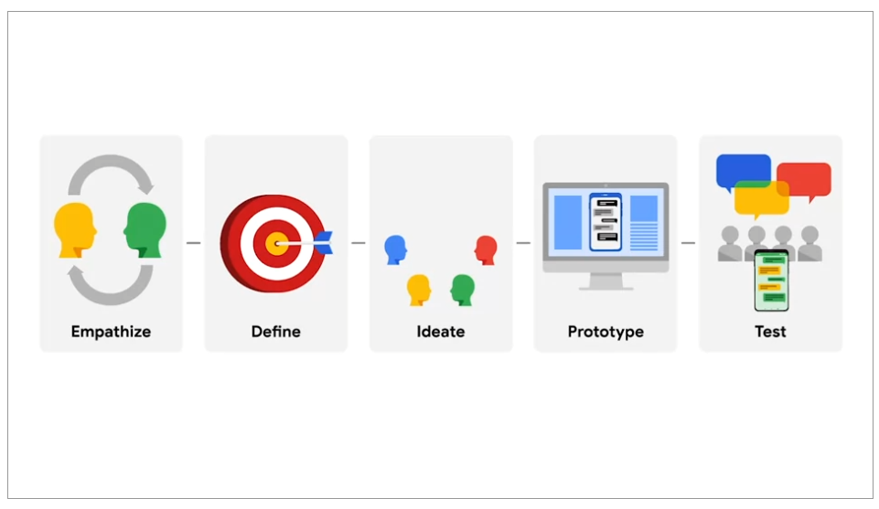

## General Info

1. Usable
2. Equitable
3. Enjoyable - research
4. Useful - solve a problem

## Different Type of UX Workers

- Interaction Designer (UX)
- Visual Deisgner (UX)
- Motion Designer (UX)
- Graphic Designer
- UX Researcher
- UX Writer
- Production Designers
- UX Engineer
- UX Program Manager

## Product Development LifeCycle

1. Brainstorm
2. Define
3. Design
4. Testing
5. Launch

## 5 Elements of UX Design

1. Strategy
2. Scope
3. Structure
4. Skeleton
5. Surface

{width: 500px}

## Design Thinking

1. Empathize
2. Define
3. Ideate
4. Prototype
5. Test

{width: 500px}
